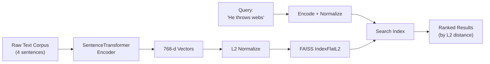
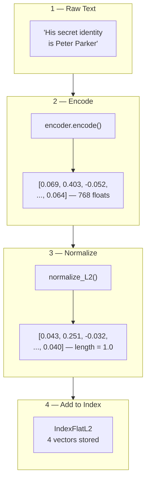
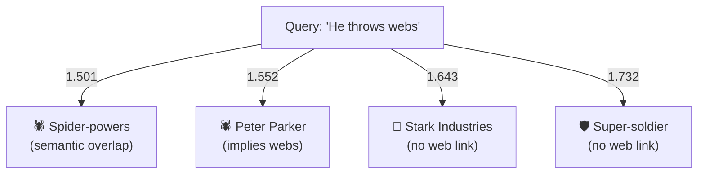

# FAISS for Text Similarity Search — Notebook Writeup

## Overview

This notebook demonstrates how to use **FAISS** (Facebook AI Similarity Search) with **SentenceTransformers** to perform semantic similarity search over a small text corpus of superhero descriptions.

> **New to these terms?** Jump to the [Key Terms](#key-terms) section at the bottom first, then come back here.

---

## Pipeline



---

## The Corpus

| Index | Text | Context |
|-------|------|---------|
| 0 | His secret identity is Peter Parker | spiderman |
| 1 | A businessman and engineer who runs the company Stark Industries | ironman |
| 2 | Superhuman spider-powers and abilities after being bitten by a radioactive spider | spiderman |
| 3 | A frail man enhanced to the peak of human physical perfection by an experimental super-soldier serum | captainamerica |

---

## Encoding → Indexing

Each sentence is transformed into a **768-dimensional vector** by the `paraphrase-mpnet-base-v2` model. These vectors are then **L2-normalized** (scaled to unit length) before being added to the FAISS index.



**Why normalize?** With unit-length vectors, L2 distance maps directly to cosine similarity:

> **L2² = 2 − 2 × cos(θ)**

| L2 Distance | Cosine Similarity | Meaning |
|-------------|-------------------|---------|
| 0.0 | 1.0 | Identical |
| ~1.41 | ~0.0 | Orthogonal (unrelated) |
| 2.0 | −1.0 | Opposite |

---

## The Search

Query: **"He throws webs"** → encoded and normalized → searched against the index.

### Results (sorted by distance, ascending = most similar first)

```
                    L2 Distance

  Spiderman         ████████████████░░░░░░░░░  1.501  ← closest
  (powers)          (index 2)

  Spiderman         █████████████████░░░░░░░░  1.552
  (Peter Parker)    (index 0)

  Iron Man          ██████████████████░░░░░░░  1.643
                    (index 1)

  Captain America   ████████████████████░░░░░  1.732  ← farthest
                    (index 3)

                    1.4   1.5   1.6   1.7   1.8
```

| Rank | Index | Distance | Text | Context |
|------|-------|----------|------|---------|
| 1 | 2 | 1.501 | Superhuman spider-powers and abilities... | spiderman |
| 2 | 0 | 1.552 | His secret identity is Peter Parker | spiderman |
| 3 | 1 | 1.642 | A businessman and engineer who runs... | ironman |
| 4 | 3 | 1.732 | A frail man enhanced to the peak of... | captainamerica |

---

## Why These Rankings Make Sense



- **Index 2** (spider-powers) ranks first because it shares direct semantic content with "webs" — spiders, powers, abilities.
- **Index 0** (Peter Parker) ranks second — the model understands Peter Parker = Spider-Man, who is associated with webs.
- **Index 1 & 3** (Iron Man, Captain America) rank last — they're superheroes, but have no semantic connection to web-throwing.

---

## Key Takeaways

1. **FAISS `IndexFlatL2`** performs exact brute-force search — no approximation. The "ANN" variable name is a FAISS API convention, not a description of the algorithm used here.
2. **L2-normalized vectors** let you interpret L2 distance as a direct proxy for cosine similarity, making results intuitive.
3. **SentenceTransformers** capture deep semantic meaning — the model doesn't just match keywords. It understands that "Peter Parker" relates to "webs" even though those words never co-occur in the corpus.
4. This forms the **retrieval step** in a RAG (Retrieval-Augmented Generation) pipeline: given a query, find the most relevant context from a knowledge base to feed into an LLM.

---

## Key Terms

| Term | Plain-English Definition |
|------|--------------------------|
| **FAISS** | A library by Meta for quickly finding items that are similar to a query. Think of it as a search engine for vectors instead of text. |
| **Vector / Embedding** | A list of numbers that represents the meaning of a sentence. Similar sentences end up with similar lists of numbers. |
| **768-dimensional** | Each sentence gets turned into a list of 768 numbers. "Dimensional" just means how many numbers are in the list. |
| **SentenceTransformer** | A pre-trained model that converts a sentence into a vector. It has already learned what words and phrases mean from training on large datasets. |
| **L2 Distance (Euclidean)** | A way to measure how far apart two vectors are — like measuring the straight-line distance between two points on a map. Smaller distance = more similar. |
| **L2 Normalization** | Scaling each vector so its total length equals 1. This makes distance comparisons fair, regardless of how long the original vectors were. |
| **Cosine Similarity** | A way to measure how similar two vectors are by looking at the angle between them, not their length. Ranges from -1 (opposite) to 1 (identical). After L2 normalization, L2 distance and cosine similarity tell you the same thing. |
| **IndexFlatL2** | A specific FAISS index type that compares the query against every single vector (brute-force). Exact results, but slower on large datasets. |
| **ANN (Approximate Nearest Neighbors)** | A family of algorithms that trade a small amount of accuracy for much faster search on large datasets. The variable name `ann` in the notebook is just a FAISS convention — `IndexFlatL2` actually returns exact results. |
| **Semantic Similarity** | How close two pieces of text are in meaning, not just in the words they share. "He throws webs" and "Peter Parker" share no words, but a good model knows they're related. |
| **RAG (Retrieval-Augmented Generation)** | A pattern where you first search a knowledge base for relevant context, then feed that context to an LLM so it can generate a more informed answer. This notebook covers the retrieval (search) step. |
