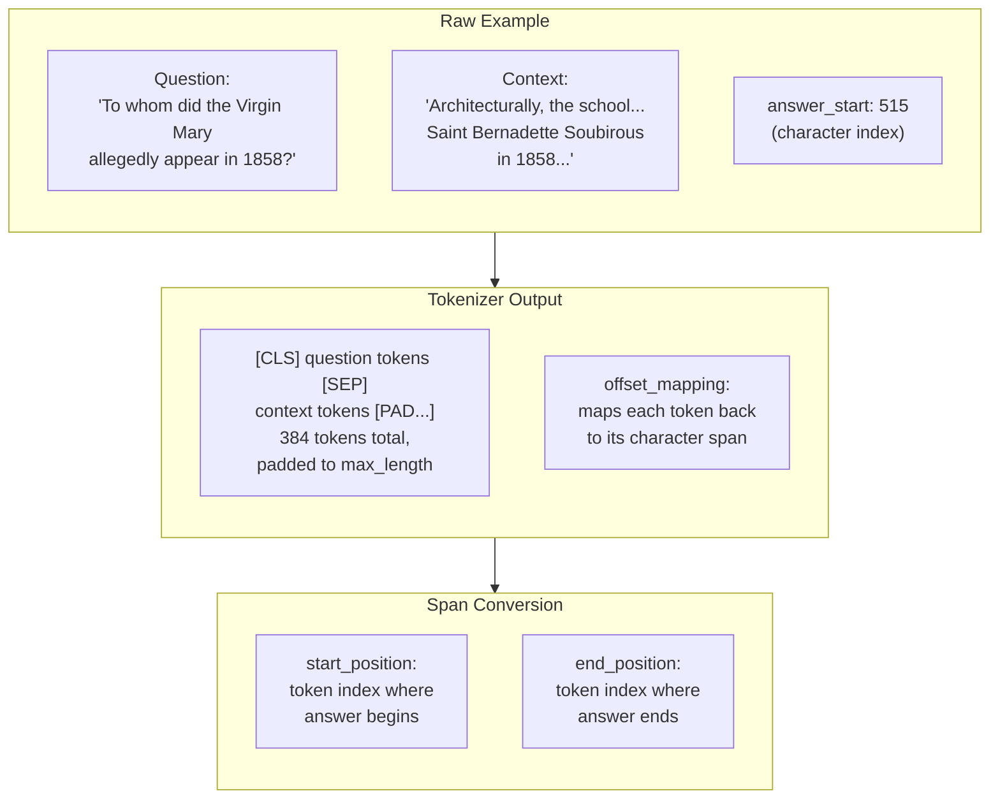
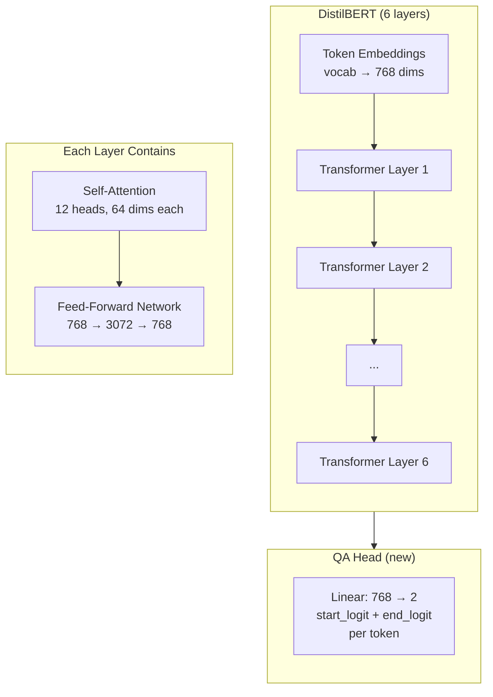
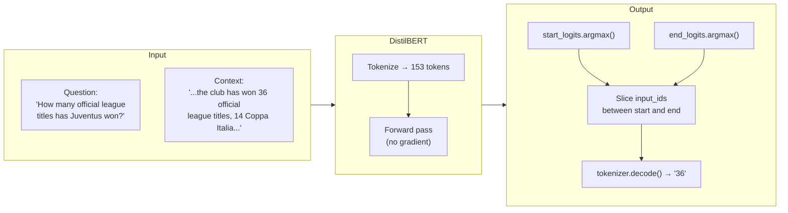
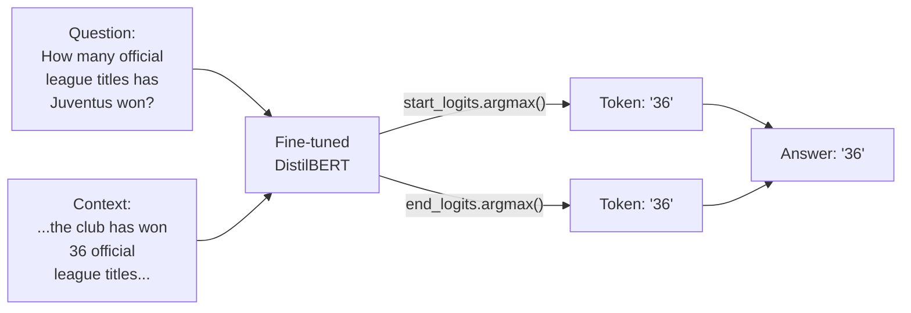

# Fine-Tuning DistilBERT for Extractive Question Answering — Notebook Writeup

## Overview

This notebook fine-tunes DistilBERT (a smaller, distilled version of BERT) on the SQuAD dataset to perform **extractive question answering** — given a paragraph and a question, the model finds the answer by pointing to a substring in the paragraph. This is not text generation; the model never creates new words. It predicts a start index and an end index, and the answer is just a slice of the input.

> **New to these terms?** Jump to the [Key Terms](#key-terms) section at the bottom first, then come back here.

## Pipeline


## The Data / Corpus

The dataset is a 5,000-sample subset of [**SQuAD**](https://huggingface.co/datasets/rajpurkar/squad) (Stanford Question Answering Dataset), built from Wikipedia articles. Each example is a triplet:

| Field | Type | Example (index 0) |
|---|---|---|
| `context` | Wikipedia paragraph | *"Architecturally, the school has a Catholic character. Atop the Main Building's gold dome is a golden statue of the Virgin Mary..."* |
| `question` | A question about the paragraph | *"To whom did the Virgin Mary allegedly appear in 1858 in Lourdes France?"* |
| `answers` | The exact substring + character offset | `text: "Saint Bernadette Soubirous"`, `answer_start: 515` |

The questions come from a Wikipedia article about the University of Notre Dame — the dataset doesn't have a specific topic, it just uses whatever Wikipedia articles are in the corpus.

## Step 1: Load and Split the Dataset

```python
squad = load_dataset("squad", split="train[:5000]")
squad = squad.train_test_split(test_size=0.2)
```

The full SQuAD training set has 87,599 examples. The notebook loads only the first 5,000 and splits them:

| Split | Samples | Purpose |
|---|---|---|
| Train | 4,000 | Fine-tune the model |
| Test | 1,000 | Evaluate after each epoch |

## Step 2: Tokenize and Map Answer Spans

This is the most involved step. The raw data has answer positions as **character offsets** (e.g., `answer_start: 515` means the answer begins at the 515th character in the context string). But the model works with **tokens**, not characters. The `preprocess_function` converts between the two.



Key details in `preprocess_function`:

1. **Tokenization** — The question and context are tokenized together into a single sequence: `[CLS] question_tokens [SEP] context_tokens [PAD...]`, padded/truncated to 384 tokens. The tokenizer receives two inputs (question as the first, context as the second). `truncation="only_second"` means: if the combined sequence exceeds 384 tokens, only chop tokens off the **second input** (the context), never the question. This matters because the question is usually short and must stay intact for the model to understand what's being asked. The context is the long part and can afford to lose its tail end.

2. **`sequence_ids`** — Each token is tagged with `None` (special tokens), `0` (question), or `1` (context). This lets the function find where the context starts and ends in the token sequence.

3. **Character-to-token conversion** — Using `offset_mapping` (each token's character start/end), the function walks through the context tokens to find which token contains the answer's start character and which contains the end character. If the answer got truncated away, both positions are set to `0`.

The result: every example now has `start_positions` and `end_positions` as integer token indices — the model's training targets.

## Step 3: Fine-Tune DistilBERT

```python
model = AutoModelForQuestionAnswering.from_pretrained("distilbert-base-uncased")
```

Loading the model produces this message:

> *Some weights of DistilBertForQuestionAnswering were not initialized from the model checkpoint: `['qa_outputs.bias', 'qa_outputs.weight']`*

This tells you that DistilBERT's base weights are pre-trained (on masked language modeling), but the **QA head** (`qa_outputs`) is brand new — a randomly initialized `Linear(768, 2)` layer that you never see in your notebook code. It's created automatically inside the `DistilBertForQuestionAnswering` class when `AutoModelForQuestionAnswering` loads the model. The output dimension is `2` because it produces two scores per token:

| Output index | What it means |
|---|---|
| 0 | `start_logit` — how likely this token is the **start** of the answer |
| 1 | `end_logit` — how likely this token is the **end** of the answer |

So `qa_outputs.weight` has shape `(2, 768)` and `qa_outputs.bias` has shape `(2)`. Training teaches this layer (and fine-tunes the rest of the model) to put high scores on the correct answer tokens.

### Hugging Face Task Heads

`AutoModelForQuestionAnswering` is just one of several `AutoModelFor___` classes. Each one loads the same base model but adds a different task-specific head on top:

| Class | Head added | Output |
|---|---|---|
| `AutoModelForQuestionAnswering` | `Linear(768, 2)` — start/end logits | Span prediction |
| `AutoModelForSequenceClassification` | `Linear(768, num_labels)` | Sentiment, topic, etc. |
| `AutoModelForTokenClassification` | `Linear(768, num_labels)` per token | NER, POS tagging |
| `AutoModelForCausalLM` | `Linear(768, vocab_size)` | Text generation |
| `AutoModelForMaskedLM` | `Linear(768, vocab_size)` | Fill-in-the-blank |
| `AutoModel` | None | Raw hidden states |

The head is always at the very end — the base transformer layers are untouched. The head is almost always a single `Linear` layer, randomly initialized, and fine-tuning trains it to read the representations the base model already learned. To switch tasks, you just swap the class and train on a different dataset.

### Model Architecture



The **feed-forward network (FFN)** inside each transformer layer is a simple two-layer neural network:

| Layer | Shape | Role |
|---|---|---|
| Linear 1 | 768 → 3072 | Expand to wider space |
| GeLU | — | Nonlinear activation |
| Linear 2 | 3072 → 768 | Compress back |

The 4x expansion (768 x 4 = 3072) gives the model more room to learn patterns, then compresses back to 768 so it plugs into the residual stream. The 3072-dimensional representation only exists temporarily inside the FFN — it never leaves.

### Training Hyperparameters

| Parameter | Value |
|---|---|
| Learning rate | 2e-5 |
| Batch size (train + eval) | 16 |
| Epochs | 3 |
| Weight decay | 0.01 |
| Total steps | 750 |
| Training loss | 2.303 |
| Runtime | 588.8s (~9.8 min) |
| Throughput | 20.4 samples/sec |
| Device (training) | MPS (Apple Silicon GPU) — placed via `device_map="auto"` on model load |

## Step 4: Inference

After training, the model is tested with a new question and context about Juventus Football Club. The device is set explicitly this time with `device = "mps"`:



The inference code:

```python
# Tokenize question + context
inputs = tokenizer(question, context, return_tensors="pt")

# Forward pass — no generation, just scoring
with torch.no_grad():
    outputs = model(**inputs)

# Pick the highest-scoring start and end tokens
answer_start_index = outputs.start_logits.argmax()
answer_end_index = outputs.end_logits.argmax()

# Slice the original input tokens and decode
predict_answer_tokens = inputs.input_ids[0, answer_start_index : answer_end_index + 1]
tokenizer.decode(predict_answer_tokens)
```

## Step 5: Upload to Hugging Face

The fine-tuned model was uploaded to Hugging Face for reuse without retraining:

```python
# Load the model from Hugging Face (no local checkpoint needed)
tokenizer = AutoTokenizer.from_pretrained("John-Machado/distilbert-squad-qa")
model = AutoModelForQuestionAnswering.from_pretrained("John-Machado/distilbert-squad-qa")
```

The model is publicly available at [`John-Machado/distilbert-squad-qa`](https://huggingface.co/John-Machado/distilbert-squad-qa). Only the final checkpoint (step 750, end of epoch 3) was uploaded — intermediate checkpoints were discarded.

## Results

The model correctly extracts `"36"` from the context paragraph. This is a direct substring — the model pointed to the token(s) for "36" in the input and sliced them out. No text was generated.

## Interpretation



The model learned to match the semantic pattern of the question ("How many...titles...won") to the relevant part of the context ("has won 36 official league titles"). Because this is extractive QA, the answer **cannot be hallucinated** — it must exist verbatim in the context. If the context didn't contain the answer, the model would still point somewhere, but it would be wrong.

### Extractive QA vs. Generative Models

| | Extractive QA (this notebook) | Generative (e.g., GPT) |
|---|---|---|
| Output | Start index + end index | New tokens, one at a time |
| Answer source | Copied from the input context | Generated from scratch |
| Architecture | Encoder-only (DistilBERT) | Decoder-only |
| Can hallucinate? | No — answer must exist in the passage | Yes |
| Use case | Finding facts in documents | Open-ended text generation |

## Key Takeaways

1. **Extractive QA is span prediction, not generation.** The model scores every token in the context twice (start and end), and the answer is just a slice of the input between the highest-scoring positions.

2. **The preprocessing is the hardest part.** Converting character-level answer offsets to token-level positions requires offset mappings and careful boundary handling — the actual training and inference code is straightforward.

3. **The QA head is tiny.** DistilBERT's pre-trained weights (66M parameters across 6 layers) do the heavy lifting. The new `qa_outputs` layer is just a single `Linear(768, 2)` — mapping each token's hidden state to two scores.

4. **The FFN's 768 → 3072 → 768 bottleneck** is where each transformer layer does its per-token computation. The 4x expansion gives the model more representational capacity, and the GeLU activation between the two linear layers is what makes it nonlinear.

5. **Extractive QA can't hallucinate** because the answer is physically constrained to be a substring of the provided context — a useful property when factual accuracy matters more than fluency.

## Key Terms

| Term | Plain-English Definition |
|---|---|
| Extractive QA | A task where the model answers a question by highlighting a span of text from a given passage, rather than generating new text. |
| [SQuAD](https://huggingface.co/datasets/rajpurkar/squad) | Stanford Question Answering Dataset — a benchmark of 100K+ question-answer pairs built from Wikipedia paragraphs, where every answer is a substring of the context. |
| DistilBERT | A smaller, faster version of BERT created by "distilling" the knowledge of the full model into 6 layers instead of 12. About 60% faster with 97% of BERT's performance. |
| Span prediction | Predicting a start position and end position within a sequence. The text between those two positions is the predicted answer. |
| Tokenizer | Converts raw text into integer token IDs the model can process. Also handles special tokens like `[CLS]` and `[SEP]` and can map tokens back to character positions via offset mappings. |
| `start_logits` / `end_logits` | Raw scores the model outputs for every token position. Higher score = more likely to be the start (or end) of the answer. `argmax()` picks the highest-scoring position. |
| `offset_mapping` | A list of (start_char, end_char) tuples telling you which characters in the original text each token corresponds to. Used to convert between character-level and token-level positions. |
| `sequence_ids` | Tags each token as belonging to the question (`0`), context (`1`), or special/padding (`None`). Used to find where the context starts and ends in the tokenized input. |
| Feed-forward network (FFN) | A two-layer neural network inside each transformer layer that processes each token independently. In DistilBERT: Linear(768→3072) → GeLU → Linear(3072→768). |
| `hidden_dim` | The width of the intermediate layer in the FFN (3072 in DistilBERT). This is the temporary expanded space where per-token computation happens. |
| QA head | The final output layer (`qa_outputs`) added on top of the pre-trained model. A single Linear(768→2) that produces start and end logits for each token. Randomly initialized before fine-tuning. |
| `AutoModelFor___` | A family of Hugging Face classes that load a pre-trained base model and attach a task-specific head. `AutoModelForQuestionAnswering` adds a span predictor, `AutoModelForSequenceClassification` adds a classifier, etc. Same base weights, different output layer. |
| Residual stream | The main "highway" of information flowing through the transformer. Each sub-layer (attention, FFN) adds its output back to this stream, so information from earlier layers isn't lost. |
| GeLU | Gaussian Error Linear Unit — an activation function used between the two linear layers in the FFN. Without it, stacking two linear layers would collapse into a single linear transformation. |
| Fine-tuning | Taking a pre-trained model and continuing training on a smaller, task-specific dataset. Most of the model's knowledge comes from pre-training; fine-tuning adapts it to the specific task (here, QA). |
| Weight decay | A regularization technique that slightly shrinks model weights each step to prevent overfitting. Set to 0.01 in this notebook. |
| MPS | Metal Performance Shaders — Apple's GPU acceleration framework. The notebook runs on this instead of CUDA since it's on a Mac. |
