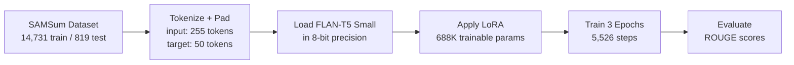
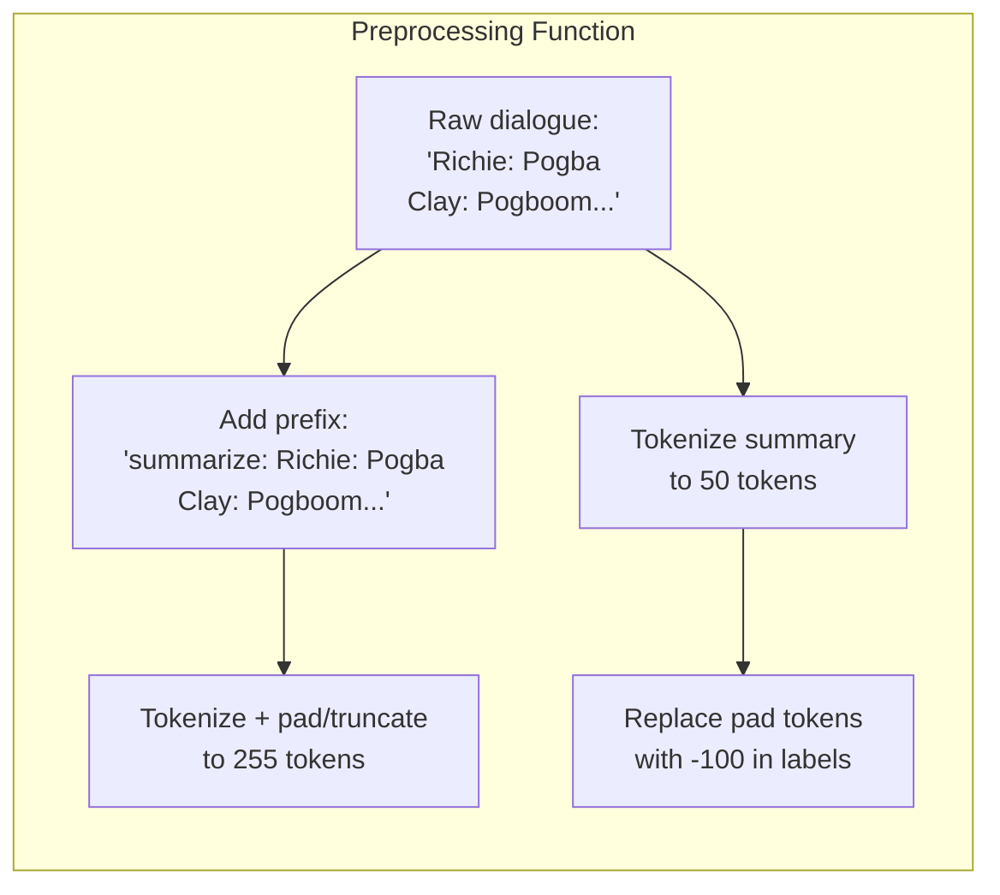
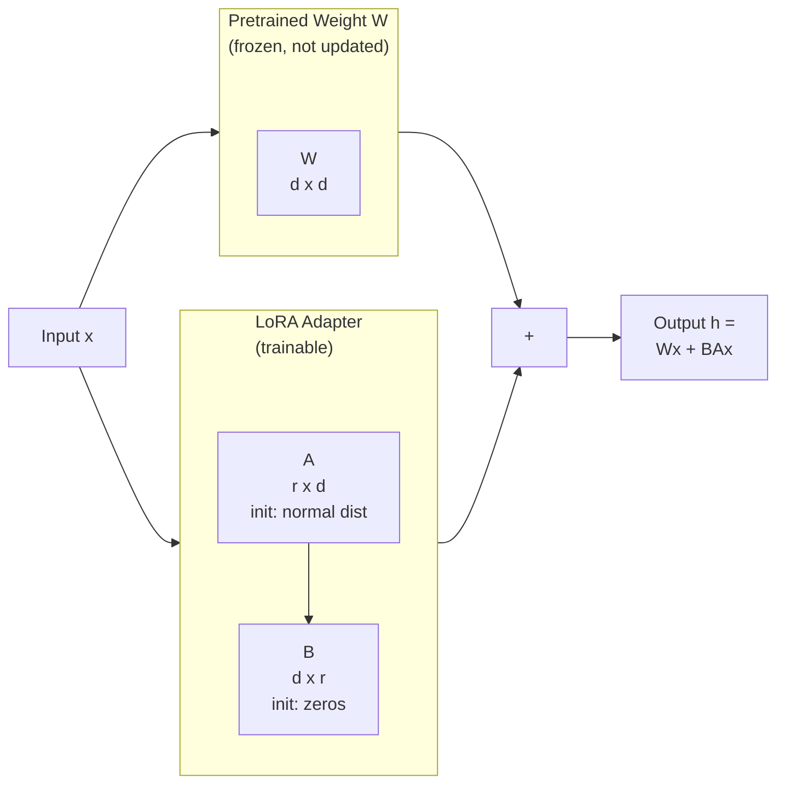
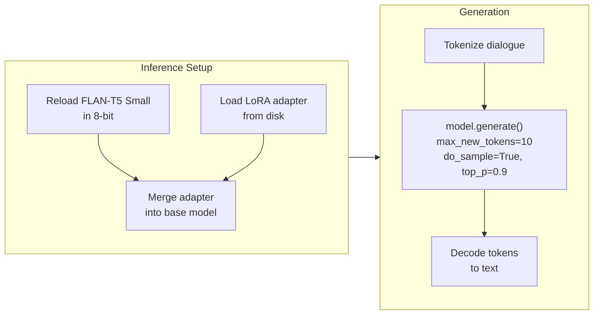
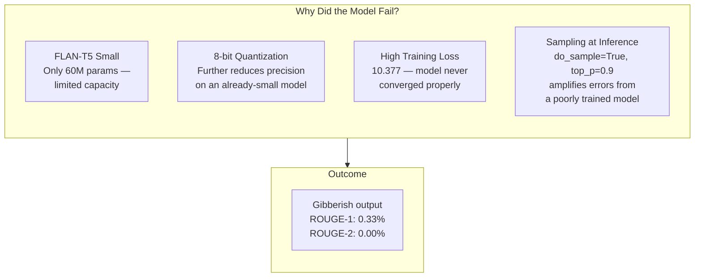

# LoRA Fine-Tuning FLAN-T5 for Dialogue Summarization — Notebook Writeup

## Overview

This notebook applies **LoRA** (Low-Rank Adaptation), a parameter-efficient fine-tuning technique, to FLAN-T5 Small for dialogue summarization on the SAMSum dataset. Instead of updating all 110 million parameters, LoRA freezes the base model and injects small trainable matrices into the attention layers — training only 0.62% of the total parameters. The model is loaded in 8-bit precision to further reduce memory usage.

> **New to these terms?** Jump to the [Key Terms](#key-terms) section at the bottom first, then come back here.

## Pipeline



## The Data / Corpus

The dataset is [**SAMSum**](https://huggingface.co/datasets/knkarthick/samsum) — a collection of messenger-like conversations in English with human-written summaries. Each example is a dialogue-summary pair:

| Field | Type | Example (from test set) |
|---|---|---|
| `dialogue` | Multi-turn conversation | *"Richie: Pogba / Clay: Pogboom / Richie: what a strike yoh! / Clay: was off the seat the moment he chopped the ball back to his right foot..."* |
| `summary` | Human-written summary | *(reference summary for this conversation)* |

| Split | Samples |
|---|---|
| Train | 14,731 |
| Test | 819 |

The task is **abstractive summarization**: given a conversation, produce a concise summary that captures the key points. Unlike extractive QA (the previous notebook), the model must generate new text, not just point to a span.

## Step 1: Load and Tokenize the Dataset

SAMSum is loaded from the Hugging Face Hub, and the FLAN-T5 tokenizer is used to convert the dialogues and summaries into token sequences.

The notebook calculates optimal sequence lengths using percentiles across the full dataset (train + test combined), so that most examples fit without excessive padding:

| Sequence | Percentile | Max Length |
|---|---|---|
| Input (dialogue) | 85th | 255 tokens |
| Target (summary) | 90th | 50 tokens |



The `"summarize: "` prefix is a prompt convention for FLAN-T5 — it tells the encoder-decoder model what task to perform. Padding tokens in the labels are replaced with `-100`, a special value that PyTorch's cross-entropy loss ignores, so the model isn't penalized for predicting padding.

## Step 2: Load FLAN-T5 in 8-Bit Precision

```python
model = AutoModelForSeq2SeqLM.from_pretrained(
    "google/flan-t5-small",
    quantization_config=BitsAndBytesConfig(load_in_8bit=True),
    device_map="auto"
)
```

FLAN-T5 is an instruction-tuned version of Google's T5 model with an **encoder-decoder** architecture — the encoder reads the input dialogue, and the decoder generates the summary token by token. The book describes it as "a combination of a novel instruction-tuned T5 (FlanNet) and T5, developed by Google in 2020... an upgrade of the original T5 model to improve the effectiveness of zero-shot learning" (Chapter 2, p. 37).

The model is loaded in **8-bit precision** using BitsAndBytes. Normal model weights are 32-bit floating point numbers; 8-bit quantization compresses them to integers with only 256 possible values. This cuts memory usage by roughly 4x, making it possible to fine-tune on a free Colab GPU. The trade-off is some loss of precision in the weights.

The book notes: "While we are considering the smallest of the FLAN-T5 family, the same code and considerations presented here apply to the larger ones (from 250M, up to 11B)" (Chapter 2, p. 37).

## Step 3: Apply LoRA

This is the core of the notebook. Instead of fine-tuning all 110 million parameters, LoRA injects small trainable matrices into specific layers while keeping the rest frozen.

### How LoRA Works

The key insight (from the [original paper](https://arxiv.org/abs/2106.09685), referenced in the book's Figure 2.3): when you fine-tune a large model, the weight updates tend to have **low rank** — meaning they can be approximated by the product of two much smaller matrices.

For a weight matrix **W** of size *d x d*, instead of learning a full *d x d* update, LoRA learns two matrices:
- **A** (size *r x d*) — initialized from a normal distribution
- **B** (size *d x r*) — initialized to zero

The update is their product **BA**, which has rank at most *r*. Since *r* is much smaller than *d*, this is far fewer parameters.



Because **B** starts at zero, the LoRA adapter initially has no effect — the model behaves exactly like the pretrained version at the start of training. As training progresses, **A** and **B** learn the task-specific adjustments.

### LoRA Configuration

| Parameter | Value | What It Controls |
|---|---|---|
| `r` | 16 | Rank of the decomposition — higher means more capacity but more parameters |
| `lora_alpha` | 32 | Scaling factor applied to the LoRA output (effectively `alpha/r = 2x` multiplier) |
| `target_modules` | `["q", "v"]` | Which weight matrices get LoRA adapters — here, the Query and Value projections in every attention layer |
| `lora_dropout` | 0.05 | Dropout on the LoRA path for regularization |
| `bias` | `"none"` | No bias terms added to the LoRA layers |
| `task_type` | `SEQ_2_SEQ_LM` | Tells PEFT this is a sequence-to-sequence task |

### Why Q and V?

The original LoRA paper found that adapting the **Query** and **Value** matrices in attention layers is sufficient for good performance. The Key and Output projection matrices can be left frozen without significant loss. This halves the number of LoRA parameters compared to adapting all four attention matrices.

### Parameter Count

```
trainable params:   688,128
all params:         110,548,352
trainable%:         0.6225%
```

Out of 110.5 million total parameters, only 688K are trainable — less than 1%. The book emphasizes this: "this training process wouldn't be computationally hungry such as fine tuning of the full model" (Chapter 2, p. 40).

## Step 4: Train

| Parameter | Value |
|---|---|
| Learning rate | 1e-3 |
| Epochs | 3 |
| Batch size | Auto-detected |
| Total steps | 5,526 |
| Logging interval | Every 500 steps |
| Save strategy | None (save manually after training) |

The `DataCollatorForSeq2Seq` handles batching — it dynamically pads each batch to the longest sequence in that batch (with `pad_to_multiple_of=8` for GPU efficiency), rather than padding everything to the global max length.

### Training Output

| Metric | Value |
|---|---|
| Final training loss | 10.377 |
| Runtime | 2,056.89s (~34 min) |
| Throughput | 21.5 samples/sec |
| Steps/sec | 2.687 |

The training loss of 10.377 is notably high for a summarization task. For reference, a well-converging fine-tuning run on FLAN-T5 typically ends with a loss below 2.0. This is an early signal that the model is struggling.

After training, the LoRA adapter weights are saved separately from the base model — only the 688K trainable parameters are stored to disk, not the full 110M.

## Step 5: Inference

For inference, the base FLAN-T5 model is reloaded in 8-bit, and the saved LoRA adapter is merged back in:

```python
config = PeftConfig.from_pretrained("flan_t5_lora")
model = AutoModelForSeq2SeqLM.from_pretrained(config.base_model_name_or_path, ...)
model = PeftModel.from_pretrained(model, "flan_t5_lora")
```



### Sample Output

**Input dialogue:**
> Richie: Pogba
> Clay: Pogboom
> Richie: what a strike yoh!
> Clay: was off the seat the moment he chopped the ball back to his right foot
> Richie: me too dude
> Clay: hope his form lasts
> ...

**Generated summary:**
> demandé acasă overwhelmed Hai Diploma60Appel8% béton passing

This is gibberish — a mix of French, Romanian, and random tokens. The model has not learned to summarize dialogues. A reasonable summary would be something like *"Richie and Clay discuss Pogba's impressive strike and hope his good form continues."*

## Step 6: Evaluate with ROUGE

The model is evaluated on all 819 test samples using **ROUGE** (Recall-Oriented Understudy for Gisting Evaluation), the standard metric for summarization. ROUGE measures n-gram overlap between the generated summary and the human-written reference:

| Metric | What It Measures | Score |
|---|---|---|
| ROUGE-1 | Unigram (single word) overlap | 0.33% |
| ROUGE-2 | Bigram (two-word phrase) overlap | 0.00% |
| ROUGE-L | Longest common subsequence | 0.32% |
| ROUGE-Lsum | ROUGE-L applied to summary-level | 0.32% |

Evaluation took **36 minutes 48 seconds** (~2.7 seconds per sample).

## Results

```
ROUGE Scores (% overlap with reference summaries)
═══════════════════════════════════════════════════

ROUGE-1    | ▏ 0.33%
ROUGE-2    |   0.00%
ROUGE-L    | ▏ 0.32%
ROUGE-Lsum | ▏ 0.32%
           └──────────────────────────────────────
           0%       10%       20%       30%      40%

For reference, a competent summarization model typically
scores 40-50% ROUGE-1 on SAMSum.
```

| Metric | This Model | Typical Baseline |
|---|---|---|
| ROUGE-1 | 0.33% | ~40-50% |
| ROUGE-2 | 0.00% | ~18-25% |
| ROUGE-L | 0.32% | ~35-40% |

The model's scores are effectively zero — it has not learned to summarize.

## Interpretation

The LoRA technique was applied correctly, but the results show the model failed to learn the task. Several factors likely contributed:



**1. Model size is the primary bottleneck.** FLAN-T5 Small has roughly 60 million parameters. Abstractive summarization is a demanding task — the model must understand the dialogue, identify key points, and generate coherent new text. Larger variants (FLAN-T5 Base at 250M, Large at 780M, XL at 3B) have substantially more capacity. The book explicitly notes the same code applies to these larger models.

**2. 8-bit quantization on a small model is risky.** Quantization trades precision for memory savings. On a large model with billions of parameters, this precision loss is absorbed across many weights. On a 60M-parameter model, the loss is proportionally more damaging — there's less redundancy to compensate.

**3. The training loss never came down.** A final loss of 10.377 after 3 epochs means the model barely learned from the training data. For comparison, a successful summarization fine-tuning typically ends with a loss below 2.0.

**4. Stochastic decoding amplifies weak models.** The inference code uses `do_sample=True, top_p=0.9`, meaning it samples from the top 90% of the probability distribution rather than always picking the highest-probability token. For a well-trained model, this produces diverse but coherent outputs. For a model that hasn't converged, it produces random noise.

### The Technique vs. The Result

The notebook successfully demonstrates the LoRA workflow:
1. Load a pretrained model in reduced precision
2. Attach low-rank adapters to attention layers
3. Train only the adapter parameters
4. Save and reload the adapter for inference

The poor results don't invalidate the technique — they illustrate that **model capacity matters**. LoRA can only adapt what the base model already knows. If the base model is too small to represent the task well, no amount of efficient fine-tuning will compensate. The natural next step is to apply this exact same pipeline to a larger FLAN-T5 variant.

## Key Takeaways

1. **LoRA trains less than 1% of parameters** by decomposing weight updates into two low-rank matrices (A and B). The pretrained weights stay frozen, and only the small adapter matrices are updated — 688K parameters instead of 110.5M.

2. **Targeting Q and V matrices is the standard choice.** The original LoRA paper showed that adapting the Query and Value projections in attention layers captures most of the task-specific signal, without needing to touch the Key or Output projections.

3. **8-bit quantization + LoRA enable fine-tuning on consumer GPUs** by cutting memory usage ~4x (quantization) and trainable parameters ~99% (LoRA). Together, they make it feasible to fine-tune on a free Colab GPU.

4. **Model size matters more than technique.** FLAN-T5 Small (60M params) couldn't learn dialogue summarization even with correct LoRA setup. The same pipeline on larger FLAN-T5 variants (250M-11B) would be expected to produce meaningful results.

5. **LoRA adapters are modular.** The trained adapter weights are saved separately and can be loaded onto any copy of the base model. This means you can share just the small adapter file (~2.6 MB for 688K params) instead of the full model.

## Key Terms

| Term | Plain-English Definition |
|---|---|
| LoRA (Low-Rank Adaptation) | A fine-tuning technique that freezes the original model and trains two small matrices whose product approximates the weight update. Like adding a sticky note to a textbook instead of rewriting the page. |
| PEFT (Parameter-Efficient Fine-Tuning) | A family of techniques (LoRA, Prefix Tuning, P-Tuning, etc.) that fine-tune a model by updating only a small fraction of its parameters, rather than all of them. |
| Rank (matrix) | The number of independent rows or columns in a matrix. A low-rank matrix can be expressed as the product of two smaller matrices. LoRA exploits the fact that fine-tuning updates tend to be low-rank. |
| Low-rank decomposition | Breaking a large matrix into the product of two smaller ones. If a 768x768 matrix has rank 16, it can be written as a 768x16 matrix times a 16x768 matrix — far fewer numbers to store and train. |
| FLAN-T5 | Google's instruction-tuned version of T5, an encoder-decoder language model. "FLAN" stands for Fine-tuned Language Net. Available in sizes from Small (60M) to XXL (11B). |
| Encoder-decoder | A model architecture with two parts: the encoder reads and compresses the input, and the decoder generates the output token by token. Used for tasks where input and output are different sequences (translation, summarization). |
| SAMSum | A dataset of messenger-like English conversations paired with human-written summaries. Contains 14,731 training and 819 test examples. |
| ROUGE | Recall-Oriented Understudy for Gisting Evaluation — a family of metrics that measure how much a generated summary overlaps with a reference summary. ROUGE-1 counts single-word overlap, ROUGE-2 counts two-word-phrase overlap, ROUGE-L finds the longest common subsequence. |
| BitsAndBytes | A library for quantizing model weights to 8-bit or 4-bit integers, reducing memory usage so large models can fit on smaller GPUs. |
| 8-bit quantization | Compressing 32-bit floating-point weights to 8-bit integers (256 possible values instead of ~4 billion). Cuts memory by ~4x with some loss of precision. |
| LoRA adapter | The pair of small matrices (A and B) that LoRA trains. They're saved separately from the base model and can be loaded/swapped without redownloading the full model. |
| Alpha (lora_alpha) | A scaling factor that controls how much influence the LoRA adapter has on the output. The effective scaling is `alpha / r` — with alpha=32 and r=16, the LoRA contribution is multiplied by 2. |
| Target modules | The specific weight matrices inside the model where LoRA adapters are inserted. In this notebook, `["q", "v"]` targets the Query and Value projections in every attention layer. |
| Data collator | A helper that batches and pads training examples on the fly. `DataCollatorForSeq2Seq` pads each batch to the longest example in that batch, rather than to the global maximum length. |
| Gradient checkpointing | A memory-saving technique that trades computation for memory: instead of storing all intermediate activations during the forward pass, it recomputes them during the backward pass. Essential when fine-tuning in 8-bit. |
| Seq2SeqTrainer | A Hugging Face training class specialized for sequence-to-sequence tasks (summarization, translation). Handles encoder-decoder models, generation during evaluation, and seq2seq-specific data collation. |
| Abstractive summarization | Generating a summary by writing new sentences that capture the meaning of the original text — as opposed to extractive summarization, which copies sentences verbatim from the source. |
